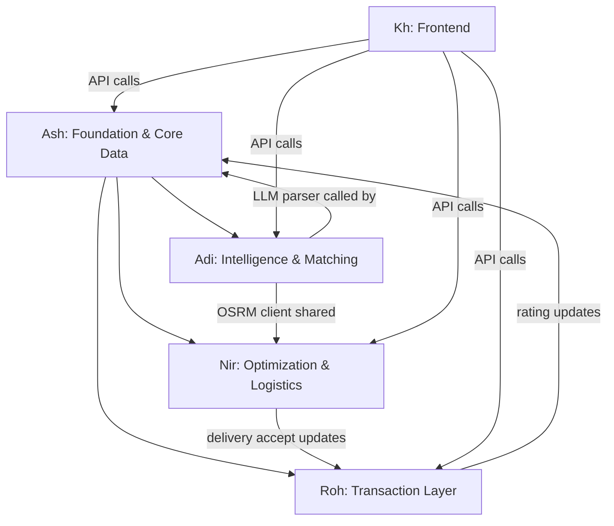

# Task Allocation — Hospitality Resource Exchange

## Team Overview

| Member | Domain | Endpoints | Complexity |
|:--|:--|:--|:--|
| **Ash** | Foundation & Core Data | 17 | Setup-heavy, high-volume CRUD |
| **Roh** | Transaction Layer | 13 | State machines, business rules |
| **Adi** | Intelligence & Matching | 3 | Algorithmic, LLM/OSRM integration |
| **Nir** | Optimization & Logistics | 12 | CP-SAT solver, driver system |
| **Kh** | Frontend (entire) | — | Full React app, both User & Driver UI |

---

## Ash — Foundation & Core Data

> Sets up the project skeleton and Firebase integration that **everyone else depends on**. Then owns the highest-volume CRUD work plus support endpoints.

### Setup (do first — others are blocked until this is done)
- FastAPI project scaffolding (folder structure, config, `.env`)
- Firebase Admin SDK initialization (Firestore client, Auth, Storage)
- Auth middleware: verify Firebase ID token → extract `userId`
- Standard response format (`{ success, data }` / `{ success, error }`)
- Error handling patterns

### Endpoints

| # | Method | Path | Notes |
|:--|:--|:--|:--|
| 1 | POST | `/users/profile` | Create profile after Firebase signup |
| 2 | GET | `/users/me` | Get authenticated user profile |
| 3 | PATCH | `/users/me` | Update profile |
| 4 | POST | `/resources` | Create resource listing |
| 5 | GET | `/resources/my` | List user's resources (with filters) |
| 6 | GET | `/resources/{id}` | Resource detail + provider info |
| 7 | PATCH | `/resources/{id}` | Update resource |
| 8 | DELETE | `/resources/{id}` | Soft-delete (status → inactive) |
| 9 | POST | `/requirements` | Create requirement *(LLM parsing call delegated to Adi's module)* |
| 10 | GET | `/requirements/my` | List user's requirements |
| 11 | GET | `/requirements/{id}` | Requirement detail |
| 12 | PATCH | `/requirements/{id}` | Update requirement |
| 13 | DELETE | `/requirements/{id}` | Cancel requirement |
| 14 | GET | `/notifications` | Get user notifications |
| 15 | PATCH | `/notifications/{id}/read` | Mark notification as read |
| 16 | GET | `/dashboard/user` | User dashboard aggregates |
| 17 | GET | `/dashboard/driver` | Driver dashboard aggregates |

### Firestore Collections Owned
`users/`, `resources/`, `requirements/`, `notifications/`

### Key Notes
- `POST /requirements` accepts the request body but calls **Adi's LLM parser module** internally to extract structured `items[]` from the description — Ash owns the endpoint, Adi owns the parsing function.
- Dashboard endpoints aggregate data from collections owned by other members (bookings, routes, etc.) — coordinate read access.
- Emit notification documents when relevant events occur (provide a `createNotification()` helper that other members can import).

---

## Roh — Transaction Layer

> Owns the **entire transaction lifecycle** from request through negotiation, booking, escrow, condition evidence, to reviews. Complex state transitions and interdependencies.

### Endpoints

| # | Method | Path | Notes |
|:--|:--|:--|:--|
| 1 | POST | `/requests` | Seeker sends resource request to provider |
| 2 | GET | `/requests/provider` | Provider views incoming requests (filterable) |
| 3 | POST | `/requests/{id}/counter` | Counter-offer (price, quantity, message) |
| 4 | POST | `/requests/{id}/accept` | Accept → **creates booking** |
| 5 | POST | `/requests/{id}/reject` | Reject with reason |
| 6 | GET | `/bookings/my` | List bookings (filterable by status) |
| 7 | GET | `/bookings/{id}` | Full booking detail |
| 8 | POST | `/bookings/{id}/confirm-receipt` | Seeker confirms delivery → triggers escrow release flow |
| 9 | POST | `/escrow` | Create escrow for booking |
| 10 | POST | `/escrow/{id}/fund` | Fund escrow (mock payment) |
| 11 | POST | `/escrow/{id}/release` | Release escrow → split to provider + driver |
| 12 | GET | `/escrow/{id}` | Get escrow status and breakdown |
| 13 | POST | `/condition-evidence` | Record condition evidence (metadata; image in Firebase Storage) |
| 14 | POST | `/reviews` | Submit rating + review after booking |
| 15 | GET | `/users/{userId}/reviews` | Get provider rating + review list |

### Firestore Collections Owned
`requests/`, `bookings/`, `escrow/`, `conditionEvidence/`, `reviews/`

### Key Notes
- `POST /requests/{id}/accept` **creates a booking document** — this is the critical state transition linking requests → bookings.
- `POST /reviews` must update `users/{providerId}.rating` and `users/{providerId}.totalRatings` (write to Ash's collection). Use Firestore transaction for atomicity.
- `POST /escrow/{id}/release` splits payment: `providerAmount` + `driverAmount` + `depositReturned`. Implement the split calculation.
- Use Ash's `createNotification()` helper to fire notifications on: request received, counter-offer, accept/reject, booking confirmed, escrow funded/released, review received.

### State Machines

```
Request:  pending → countered → accepted → (booking created)
                              → rejected

Booking:  confirmed → pickup_pending → picked_up → in_transit → delivered → completed

Escrow:   PENDING → FUNDED → IN_TRANSIT → DELIVERED → RELEASED
```

---

## Adi — Intelligence & Matching

> Owns the **brain** of the system. Fewer endpoints but each involves significant algorithmic work: LLM integration, scoring pipeline, and OSRM distance calculation.

### Endpoints

| # | Method | Path | Notes |
|:--|:--|:--|:--|
| 1 | POST | `/matching/search` | Single-resource matching pipeline |
| 2 | — | *(internal module)* | LLM parser: NL description → structured `items[]` |
| 3 | — | *(internal module)* | OSRM client: distance/route calculation |

### Modules to Build

**1. LLM Parser (Groq Integration)**
- Input: free-text requirement description
- Output: `items[]` — each with `category`, `name`, `quantity`
- Provider: Groq API (Llama 3.3 70B)
- Expose as importable function `parse_requirement(description: str) -> list[Item]`
- Ash calls this from `POST /requirements`

**2. OSRM Client**
- Distance calculation between two lat/lng points
- Route geometry retrieval
- Expose as importable utility: `get_distance(from_loc, to_loc) -> float` (km)
- Used by both the search scorer and Nir's route matching

**3. Matching Pipeline (`POST /matching/search`)**
```
requirementId
    → Fetch requirement from Firestore
    → Retrieve candidate resources (by category, status=active)
    → Availability filtering (date/time overlap)
    → Distance calculation (OSRM)
    → Price calculation (price × quantity × duration)
    → Provider rating retrieval
    → Logistics availability check (query Nir's driverRoutes for compatible routes)
    → Weighted linear scoring → matchScore (0.0–1.0)
    → Generate matchReasons[]
    → Return ranked results
```

**4. Weighted Linear Scorer**
- Factors: availability (binary filter), distance (inverse), price (inverse, relative to budget), provider rating (direct), logistics compatibility (bonus)
- Output: `matchScore` (0.0–1.0) + `matchReasons` (human-readable list)
- Weights need tuning — start with equal weights and iterate

### Key Notes
- The LLM parser is called by **Ash's** `POST /requirements` endpoint — provide it as an importable module, not a separate endpoint.
- The OSRM client is shared with **Nir** for route overlap calculation — put it in a shared `utils/` or `services/` module.
- Logistics availability check queries **Nir's** `driverRoutes` collection — coordinate the query pattern.

---

## Nir — Optimization & Logistics

> Owns the **driver system** (profiles, routes, deliveries) and the **CP-SAT bundle optimizer**. Logical grouping since bundle optimization needs to consider logistics costs.

### Endpoints

| # | Method | Path | Notes |
|:--|:--|:--|:--|
| 1 | POST | `/matching/bundle` | CP-SAT optimized multi-provider bundle |
| 2 | POST | `/drivers/profile` | Create driver profile |
| 3 | GET | `/drivers/me` | Get driver profile |
| 4 | POST | `/driver-routes` | Publish route availability |
| 5 | GET | `/driver-routes/my` | List driver's routes |
| 6 | PATCH | `/driver-routes/{id}` | Update route |
| 7 | DELETE | `/driver-routes/{id}` | Deactivate route |
| 8 | GET | `/driver-routes/{id}/matches` | Find delivery opportunities for a route |
| 9 | POST | `/delivery-requests/{id}/accept` | Driver accepts matched delivery |
| 10 | PATCH | `/delivery-requests/{id}/status` | Update delivery status |

### Firestore Collections Owned
`drivers/`, `driverRoutes/`, `deliveryRequests/`

### Modules to Build

**1. CP-SAT Bundle Optimizer (`POST /matching/bundle`)**
```
requirementId
    → Fetch requirement + parsed items
    → Retrieve candidate resources per item (from Ash's collection)
    → Availability + capacity constraints
    → Cost minimization objective
    → Route compatibility with available drivers
    → Produce: itemized resource allocation + logistics plan + costs
    → Return bundle with withinBudget flag
```

**2. Driver Route Matching (`GET /driver-routes/{id}/matches`)**
- Find bookings/delivery needs compatible with a driver's route
- Calculate `routeOverlap` (0.0–1.0) using OSRM geometry (Adi's module)
- Check capacity, timing, pickup/delivery location compatibility
- Return ranked delivery opportunities with estimatedEarnings

### Key Notes
- Use **Adi's** OSRM client for route geometry and distance calculations.
- `POST /delivery-requests/{id}/accept` should update the corresponding booking's `driverId` field (write to **Roh's** bookings collection).
- `PATCH /delivery-requests/{id}/status` should trigger notifications via **Ash's** helper.
- The CP-SAT solver needs candidate resources from **Ash's** `resources` collection and compatible routes from the `driverRoutes` collection.
- Drivers have a separate Firebase Auth flow — coordinate with **Ash** on the auth middleware to handle both user and driver tokens.

---

## Kh — Frontend (Entire)

> Owns the **complete React application** — both User and Driver interfaces. Connects to FastAPI via API client layer.

### Setup
- React project (Vite)
- Firebase SDK (Auth + Storage)
- API client (`src/api/client.js` — attaches Firebase ID token, handles errors)
- Routing (React Router — separate User and Driver flows)
- Component library / design system

### User Interface Pages

| Page | API Calls | Owner Dependency |
|:--|:--|:--|
| Login / Signup | Firebase Auth → `POST /users/profile` | Ash |
| Dashboard | `GET /dashboard/user` | Ash |
| My Resources (list) | `GET /resources/my` | Ash |
| Add Resource (form) | `POST /resources` | Ash |
| Edit Resource | `PATCH /resources/{id}` | Ash |
| Resource Detail | `GET /resources/{id}` | Ash |
| Create Requirement | `POST /requirements` → `POST /matching/search` | Ash → Adi |
| My Requirements | `GET /requirements/my` | Ash |
| Search Results | `POST /matching/search` | Adi |
| Optimized Bundle | `POST /matching/bundle` | Nir |
| Send Request | `POST /requests` | Roh |
| Incoming Requests | `GET /requests/provider` | Roh |
| Negotiation | `POST /requests/{id}/counter` | Roh |
| My Bookings | `GET /bookings/my` | Roh |
| Booking Detail | `GET /bookings/{id}` | Roh |
| Confirm Receipt | `POST /bookings/{id}/confirm-receipt` | Roh |
| Escrow Status | `GET /escrow/{id}` | Roh |
| Payment (mock) | `POST /escrow` → `POST /escrow/{id}/fund` | Roh |
| Rate Provider | `POST /reviews` | Roh |
| Provider Profile | `GET /users/{userId}/reviews` | Roh |
| Notifications | `GET /notifications` | Ash |
| Condition Evidence | Firebase Storage → `POST /condition-evidence` | Roh |

### Driver Interface Pages

| Page | API Calls | Owner Dependency |
|:--|:--|:--|
| Driver Login / Signup | Firebase Auth → `POST /drivers/profile` | Nir |
| Driver Dashboard | `GET /dashboard/driver` | Ash |
| Publish Route | `POST /driver-routes` | Nir |
| My Routes | `GET /driver-routes/my` | Nir |
| Edit Route | `PATCH /driver-routes/{id}` | Nir |
| Delivery Opportunities | `GET /driver-routes/{id}/matches` | Nir |
| Accept Delivery | `POST /delivery-requests/{id}/accept` | Nir |
| Delivery Tracking | `PATCH /delivery-requests/{id}/status` | Nir |

### API Client Service Layer

```
src/api/
├── client.js          ← Central HTTP client + auth token
├── users.js           ← Ash's endpoints
├── resources.js       ← Ash's endpoints
├── requirements.js    ← Ash's endpoints
├── matching.js        ← Adi + Nir's endpoints
├── requests.js        ← Roh's endpoints
├── bookings.js        ← Roh's endpoints
├── escrow.js          ← Roh's endpoints
├── reviews.js         ← Roh's endpoints
├── drivers.js         ← Nir's endpoints
├── routes.js          ← Nir's endpoints
├── deliveries.js      ← Nir's endpoints
├── evidence.js        ← Roh's endpoints
├── notifications.js   ← Ash's endpoints
└── dashboard.js       ← Ash's endpoints
```

### Key Notes
- **Start with mock data** — build UI before APIs are ready. Use hardcoded JSON responses that match the API contract.
- Firebase Auth handles login/signup directly — no backend endpoint needed for auth itself.
- Firebase Storage handles image/video uploads directly — get download URL, then send metadata to `POST /condition-evidence`.
- Provider rating must appear in search results, resource detail, and provider profile.
- Escrow release should be triggered by fulfillment flow, not an arbitrary button.

---

## Dependency Graph



---

## Phased Timeline

### Phase 1 — Skeleton (first few hours)

| Who | Task |
|:--|:--|
| **Ash** | FastAPI project setup, Firebase config, auth middleware, response format, `createNotification()` helper |
| **Adi** | OSRM client utility, Groq API key setup, LLM parser prototype |
| **Nir** | CP-SAT solver skeleton, driver Firestore schema |
| **Roh** | State machine design (request/booking/escrow states), Firestore schema for transaction collections |
| **Kh** | React + Vite setup, Firebase Auth, routing, design system, mock data |

### Phase 2 — Core Implementation (bulk of the work)

| Who | Task |
|:--|:--|
| **Ash** | All CRUD endpoints (users, resources, requirements, notifications, dashboard) |
| **Adi** | LLM parser → matching pipeline → scorer → `POST /matching/search` |
| **Nir** | Driver CRUD → route matching → delivery endpoints → CP-SAT bundle |
| **Roh** | Requests/negotiation → bookings → escrow → condition evidence → reviews |
| **Kh** | All pages with mock data → swap to real API as endpoints come online |

### Phase 3 — Integration & Polish

| Who | Task |
|:--|:--|
| **All backend** | Cross-collection reads, notification triggers, end-to-end flow testing |
| **Kh** | Connect all API endpoints, loading/error states, responsive design |

---

## Shared Modules & Contracts

| Module | Location | Owner | Used By |
|:--|:--|:--|:--|
| Auth middleware | `middleware/auth.py` | Ash | Everyone |
| `createNotification()` | `services/notifications.py` | Ash | Roh, Nir |
| OSRM client | `services/osrm.py` | Adi | Adi, Nir |
| LLM parser | `services/llm_parser.py` | Adi | Ash (in POST /requirements) |
| Firebase client | `config/firebase.py` | Ash | Everyone |

---

## Summary Table

| Member | Collections | Endpoints | Depends On | Depended On By |
|:--|:--|:--|:--|:--|
| **Ash** | users, resources, requirements, notifications | 17 | — | Roh, Adi, Nir, Kh |
| **Roh** | requests, bookings, escrow, conditionEvidence, reviews | 15 | Ash | Kh |
| **Adi** | *(no owned collections)* | 1 + 2 modules | Ash | Ash, Nir, Kh |
| **Nir** | drivers, driverRoutes, deliveryRequests | 10 | Ash, Adi | Roh, Kh |
| **Kh** | *(frontend only)* | All (consumer) | Ash, Roh, Adi, Nir | — |
